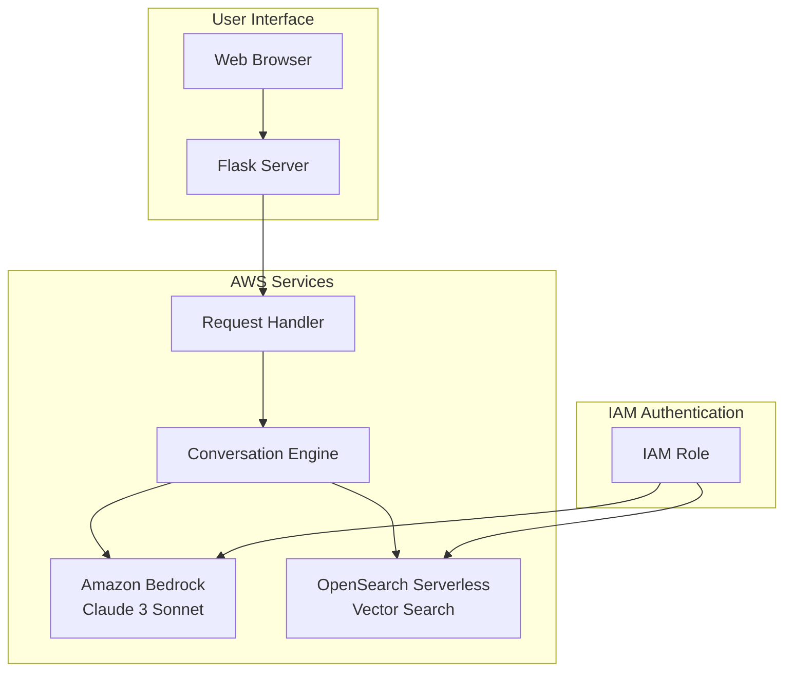

# HealthAI Assistant

<div align="center">


**An AWS-native health information assistant powered by Bedrock and OpenSearch**

*No external API keys required - runs entirely on AWS services*

[Getting Started](#-getting-started) • [AWS Setup](#-aws-setup) • [Architecture](#-architecture) • [Deployment](#-deployment)

</div>

---

## 📋 Overview

HealthAI Assistant is a production-ready conversational AI that provides reliable health information from trusted medical references. Built entirely on AWS services, it uses **Amazon Bedrock** for AI responses and **OpenSearch Serverless** for semantic search - no external API keys needed.

### Key Features

- ☁️ **100% AWS Native** - No external API keys required
- 🔐 **IAM Authentication** - Secure access using AWS IAM roles
- 🤖 **Amazon Bedrock** - Claude 3 Sonnet, Haiku, or Titan models
- 🔍 **OpenSearch Serverless** - Managed vector search
- 📚 **RAG Architecture** - Answers grounded in medical references
- 🚀 **Production Ready** - Docker containerized with CI/CD

---

## 🛠️ Tech Stack

| Component | AWS Service |
|-----------|-------------|
| **LLM** | Amazon Bedrock (Claude 3) |
| **Vector Store** | Amazon OpenSearch Serverless |
| **Compute** | Amazon EC2 / ECS |
| **Container Registry** | Amazon ECR |
| **Authentication** | AWS IAM |

---

## ☁️ AWS Setup

### Prerequisites

1. AWS Account with access to:
   - Amazon Bedrock
   - Amazon OpenSearch Serverless
   - EC2 or ECS (for deployment)

2. AWS CLI configured locally (for development)

### Step 1: Enable Bedrock Models

1. Go to **Amazon Bedrock** in AWS Console
2. Navigate to **Model access**
3. Request access to:
   - Anthropic Claude 3 Sonnet
   - (Optional) Claude 3 Haiku, Titan Text

### Step 2: Create OpenSearch Serverless Collection

```bash
# Create collection via AWS CLI
aws opensearchserverless create-collection \
    --name healthai-knowledge \
    --type VECTORSEARCH \
    --description "HealthAI vector store"
```

Or via Console:
1. Go to **Amazon OpenSearch Service**
2. Select **Serverless** → **Collections**
3. Create collection with type **Vector search**
4. Note the **Endpoint URL**

### Step 3: Configure IAM Permissions

Attach this policy to your EC2 instance role or user:

```json
{
    "Version": "2012-10-17",
    "Statement": [
        {
            "Effect": "Allow",
            "Action": [
                "bedrock:InvokeModel",
                "bedrock:InvokeModelWithResponseStream"
            ],
            "Resource": "*"
        },
        {
            "Effect": "Allow",
            "Action": [
                "aoss:*"
            ],
            "Resource": "*"
        }
    ]
}
```

---

## 🚀 Getting Started

### Installation

1. **Clone the repository**
   ```bash
   git clone https://github.com/kiran3035/healthai-assistant.git
   cd healthai-assistant
   ```

2. **Create virtual environment**
   ```bash
   python -m venv venv
   source venv/bin/activate  # Linux/Mac
   .\venv\Scripts\activate   # Windows
   ```

3. **Install dependencies**
   ```bash
   pip install -r requirements.txt
   ```

4. **Configure environment**
   ```bash
   cp .env.example .env
   ```
   
   Edit `.env`:
   ```ini
   AWS_REGION=us-east-1
   OPENSEARCH_ENDPOINT=your-collection.us-east-1.aoss.amazonaws.com
   BEDROCK_MODEL=claude-3-sonnet
   ```

5. **Configure AWS credentials** (for local development)
   ```bash
   aws configure
   ```

6. **Initialize knowledge base**
   ```bash
   python scripts/initialize_database.py
   ```

7. **Run the application**
   ```bash
   python run.py
   ```

8. **Access the interface**
   
   Open: `http://localhost:5000`

---

## 📁 Project Structure

```
healthai-assistant/
├── core/                      # Document processing
│   ├── document_processor.py
│   ├── text_chunker.py
│   └── embedding_service.py
├── services/                  # AWS integrations
│   ├── vector_database.py     # OpenSearch Serverless
│   └── conversation_engine.py # Amazon Bedrock
├── config/
│   ├── settings.py
│   └── prompts.py
├── web/                       # Flask application
│   ├── server.py
│   ├── routes.py
│   └── handlers.py
├── assets/
│   ├── views/
│   └── styles/
├── scripts/
│   └── initialize_database.py
├── knowledge_base/
├── run.py
├── Dockerfile
└── requirements.txt
```

---

## 🏗️ Architecture



---

## � Deployment

### Deploy to EC2

1. **Launch EC2 instance** (t3.medium or larger)

2. **Attach IAM role** with Bedrock and OpenSearch permissions

3. **Install Docker**
   ```bash
   curl -fsSL https://get.docker.com | sudo sh
   sudo usermod -aG docker ubuntu
   ```

4. **Deploy container**
   ```bash
   docker run -d \
     -p 5000:5000 \
     -e AWS_REGION=us-east-1 \
     -e OPENSEARCH_ENDPOINT=your-endpoint \
     your-ecr-repo/healthai-assistant:latest
   ```

### GitHub Actions CI/CD

The included workflow (`.github/workflows/deploy.yml`) automatically:
- Builds Docker image
- Pushes to Amazon ECR
- Deploys to EC2

Configure these GitHub secrets:
- `AWS_ACCESS_KEY_ID`
- `AWS_SECRET_ACCESS_KEY`
- `AWS_DEFAULT_REGION`
- `ECR_REPO`

---

## 🔧 Configuration

| Variable | Description | Default |
|----------|-------------|---------|
| `AWS_REGION` | AWS region | `us-east-1` |
| `OPENSEARCH_ENDPOINT` | OpenSearch endpoint | Required |
| `BEDROCK_MODEL` | Bedrock model | `claude-3-sonnet` |
| `SERVER_PORT` | Application port | `5000` |

### Available Bedrock Models

- `claude-3-sonnet` - Best quality (recommended)
- `claude-3-haiku` - Faster, lower cost
- `claude-instant` - Legacy, fast
- `titan-text` - Amazon's model
- `llama2` - Meta's model

---

## 📄 License

MIT License - see [LICENSE](LICENSE) file.

---

## ⚠️ Disclaimer

HealthAI Assistant provides health information for **educational purposes only**. Always consult qualified healthcare providers for medical decisions.

---

<div align="center">

**Built with ❤️ on AWS**

</div>
